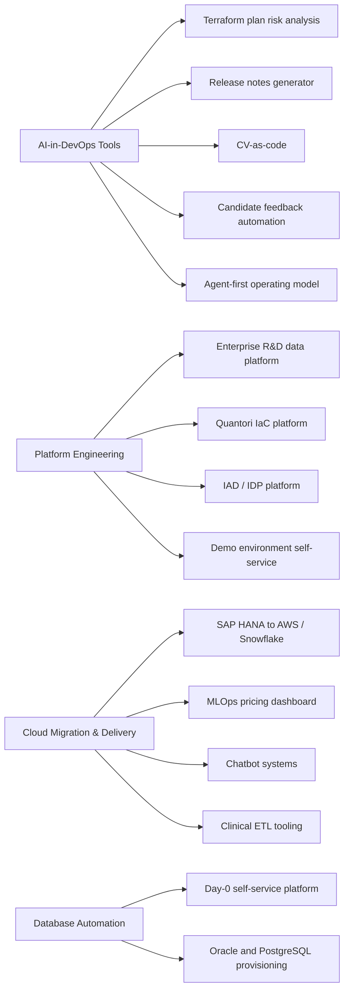

# Yuri Timerkhanov — Senior Platform / DevOps Engineer

> **AI-assisted DevOps workflows · Internal Developer Platforms · AWS · Kubernetes · Terraform**
>
> Malaysia · [yutimer@gmail.com](mailto:yutimer@gmail.com) · [LinkedIn](https://linkedin.com/in/ytimerkhanov) · [GitHub](https://github.com/yurictl)
>
> Open to senior **Platform Engineer**, **DevOps**, and **SRE** roles — remote, contract, or full-time.

---

## Fast Scan

| Signal | Evidence |
|--------|----------|
| **Senior infrastructure depth** | 20 years in tech, 9 years in DevOps, 8 years with AWS, former Oracle DBA with deep SQL tuning background |
| **AI-in-DevOps differentiator** | Built AI tools for Terraform plan review, release-note generation, CV processing, interview feedback, and agent-first documentation workflows |
| **Platform engineering range** | Internal Developer Platforms, self-service provisioning, multi-repo IaC platforms, Kubernetes delivery, observability, FinOps, CI/CD standardization |
| **Current positioning** | Designs operating models where engineers and AI agents can work safely from repo-readable documentation, validated workflows, and CLI-driven automation |

## Portfolio Map

## Strongest Proof Points

| Proof point | What changed | Source |
|-------------|--------------|--------|
| **AI Terraform review** | Review time reduced 87% (15 min to 2 min), senior escalations reduced 40%, error diagnosis time cut 60% | [TerraGuide AI](projects/terraGuide-ai.md) |
| **AI release documentation** | Deployment guide creation reduced 95% (2-4 hours to 5-10 minutes), error rate fell from ~10-15% to under 2% | [AI Release Notes Generator](projects/ai-release-notes.md) |
| **Agent-first platform work** | Three workspaces use the same agent-first operating model; 28 structured documents on the primary platform are indexed and mechanically validated | [Agent-First Operating Model](projects/agent-first-operating-model.md) |
| **Enterprise shared platform reuse** | Two greenfield projects reuse the same documentation, tooling, and Makefile framework across different AWS accounts and teams | [Enterprise R&D Data Platform](projects/shared-platform-reuse-dx.md) |
| **IaC and database platform standardization** | 30+ Terraform modules standardized; development time reduced 2-3x; database provisioning overhead cut ~40% | [Quantori IaC Platform](projects/quantori-iac-platform.md) |
| **Cloud migration under delivery pressure** | 200+ AWS resources imported without drift; infra code coverage moved from 70% to 95%; deployments became 4x faster | [SAP HANA to AWS / Snowflake](projects/sap-hana-snowflake-migration.md) |
| **Bank-scale self-service automation** | Database environment provisioning dropped from two weeks to 2 hours across 3,000+ databases | [Day-0 Self-Service Platform](projects/day-0-self-service-platform.md) |

## AI & Automation Projects

| Project | Focus | Stack | Case study |
|---------|-------|-------|------------|
| **Agent-First Operating Model** | Repo-readable documentation, agent onboarding, tool registries, custom AI workflows | Claude Code, Markdown/YAML, Python, Make, Git, Confluence CLI, glab, jira-cli, AWS CLI | [Read](projects/agent-first-operating-model.md) |
| **TerraGuide AI** | Terraform plan risk analysis and failed-apply diagnosis | Python, OpenAI GPT-4o / GPT-4o-mini, Docker, Terraform | [Read](projects/terraGuide-ai.md) |
| **AI Release Notes Generator** | Terraform module deployment guide generation | Python, Azure OpenAI GPT-4o, Docker, Bitbucket, Confluence API, Vault | [Read](projects/ai-release-notes.md) |
| **CV-as-a-Code** | Resume data pipeline and role tailoring | Claude Code, Python, RenderCV, Typst, YAML, Git | [Read](projects/cv-as-a-code.md) |
| **Candidate Feedback Tool** | Structured post-interview feedback generation | Claude Code, internal corporate tooling | [Read](projects/candidate-feedback-tool.md) |

## Infrastructure & Platform Projects

| Project | Focus | Stack | Case study |
|---------|-------|-------|------------|
| **Enterprise R&D Data Platform** | Fast greenfield delivery on shared corporate AWS/EKS infrastructure | AWS, EKS, Argo Workflows, ArgoCD, GitLab CI/CD, Terraform, Helm, Kustomize, FastAPI, OpenSearch | [Read](projects/shared-platform-reuse-dx.md) |
| **Quantori IaC Platform** | Terraform module testing, database provisioning, CI/CD standardization | Terraform, Terratest, Checkov, GitHub Actions, Roadie, Aurora, PostgreSQL, Oracle | [Read](projects/quantori-iac-platform.md) |
| **IAD / IDP Platform** | FinOps and monitoring migration on a large internal developer platform | Terraform, Terragrunt, EKS, AKS, Vault, Consul, Jenkins, Prometheus, Grafana, AppDynamics | [Read](projects/iad-framework.md) |
| **SAP HANA to AWS / Snowflake Migration** | Cloud migration, Terraform rewrite, CI/CD migration | Terraform, CloudFormation, GitHub Actions, GitLab CI/CD, ECS, Aurora DB, DynamoDB, Snowflake | [Read](projects/sap-hana-snowflake-migration.md) |
| **Booking System for Demo Environments** | Company-wide self-service demo environment provisioning | GitLab CI/CD, AWS SDK, API Gateway, CloudFront, Lambda, ECS Fargate, SQS, DynamoDB, Prometheus, Grafana | [Read](projects/demo-booking-system.md) |
| **Chatbot Systems** | Stable weekly releases for an internal ML-backed chatbot | Jenkins, Terraform, AWS SageMaker, Cognito, ECS, Route53, Aurora DB, Python | [Read](projects/chatbot-systems.md) |
| **ETL & Report Generator** | Clinical data infrastructure and CI/CD from project inception | Jenkins, Terraform, AWS ECS, Glue, Lambda, DynamoDB, Python, Node.js | [Read](projects/etl-report-generator.md) |
| **Price Elasticity Dashboard** | MLOps architecture for a client pilot | Terraform, EKS, GitHub Actions, Kubeflow, Aurora DB, MongoDB, Glue, IAM | [Read](projects/price-elasticity-dashboard.md) |
| **Day-0 Self-Service Platform** | Bank-scale Oracle/PostgreSQL environment automation | Ansible, Jenkins, Python, Bitbucket, Linux, Oracle, PostgreSQL | [Read](projects/day-0-self-service-platform.md) |

## Skills Snapshot

| Domain | Tools & Technologies |
|--------|----------------------|
| **AI & Automation** | OpenAI API, Claude Code, RAG, prompt engineering, AI agents, repo-readable operating models |
| **Cloud** | AWS, Azure |
| **Containers** | Docker, Kubernetes, Helm, Kustomize, ArgoCD, EKS, AKS |
| **CI/CD** | GitHub Actions, GitLab CI/CD, Jenkins, Bitbucket, Roadie / Backstage |
| **IaC & Scripting** | Terraform, CloudFormation, Ansible, Python, Bash |
| **IaC Quality** | Terratest, Checkov, CIS Benchmarks, HashiCorp Vault |
| **Observability** | Prometheus, Grafana, OpenTelemetry, CloudWatch, AppDynamics |
| **SRE** | SLIs/SLOs, incident response, zero-downtime releases, FinOps |
| **MLOps** | Kubeflow, MLflow, SageMaker |
| **Databases** | Oracle, PostgreSQL, Aurora DB, DynamoDB, MongoDB, Snowflake |

## Career Timeline

| Period | Role | Company |
|--------|------|---------|
| 11/2024 - present | Senior System Engineer | Quantori |
| 06/2021 - 11/2024 | Senior System Engineer | EPAM |
| 01/2015 - 06/2021 | Senior DevOps / Automation Engineer | Sber |
| 02/2009 - 01/2015 | System Engineer | MegaFon |
| 01/2005 - 12/2008 | System Administrator | Rostelecom |

## Credentials

- **Certifications:** Certified Kubernetes Administrator (active until Mar 2027), AWS Certified AI Practitioner (active until Oct 2027)
- **Education:** Master's in Mathematics, Ural State University (2000-2006)

## Recommendations

- **Pavel Konan, CTO, Enginerasoft:** highlighted senior-level cloud infrastructure, automation, AWS migration, DevOps pipeline, mentoring, and knowledge-sharing strengths.
- **Dana Forberger MBA, Associate Director, Global Clinical Data Integration Operations, Merck:** highlighted ownership of an automation tool that reduced a major manual process from approximately six months to about one week.
- **Sergey Samoylov, DevOps Engineer, former Sberbank-Technology:** highlighted critical database support, Oracle cluster work, machine learning environment support, and high-level automation expertise.
